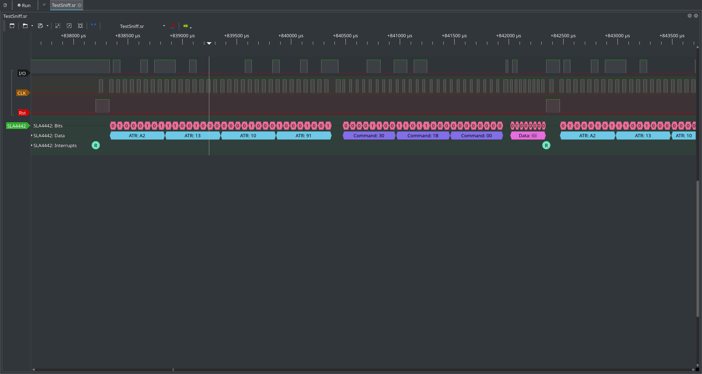

# SLE44xx serial protocol decoder
This is a simple (and perfectible) protocol decoder for Siemens/Infineon SLE 4418/28/32/42 memory cards serial protocol.

ATR, commands and data packets are separated and reset/abort events marked independently. LSB data streams are decoded.

## Usage
At the moment this plugin is not yet integrated in Sigrok and I don't know if it will ever be since I can't produce sample sniffs of my system due to legal reasons.

You can still use the plugin with the following commands
```
git clone https://github.com/ceres-c/SLExx-Sigrok.git
cd SLExx-Sigrok
SIGROKDECODE_DIR=. pulseview
```

## Example output
